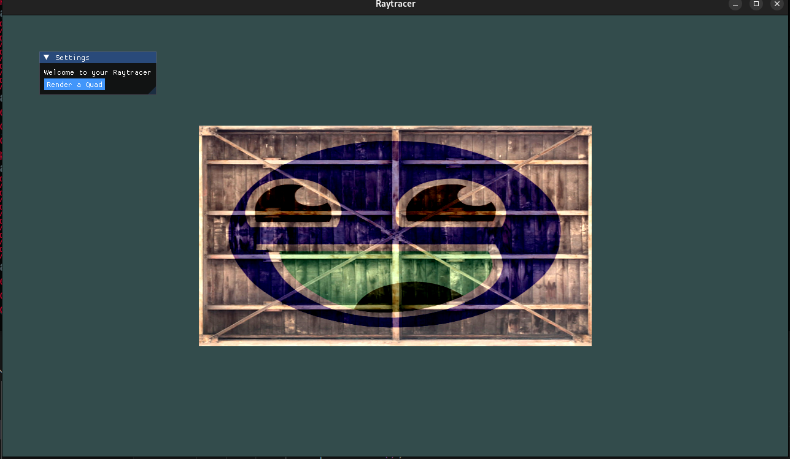
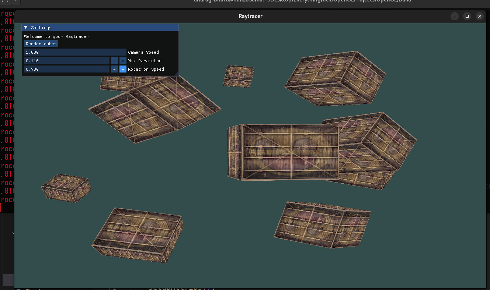
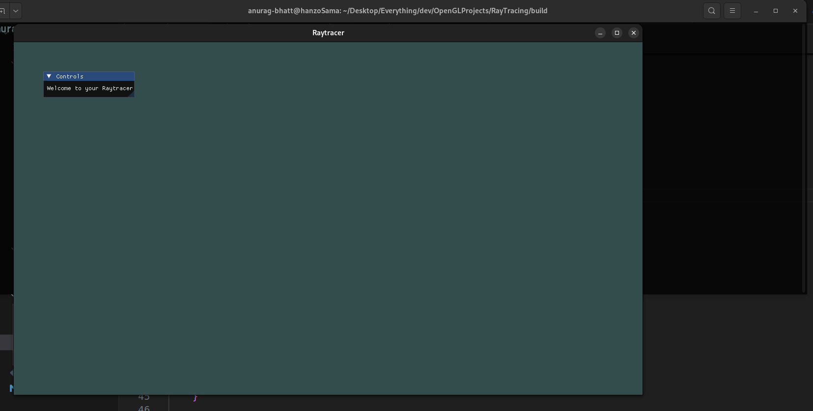

#  DevToolbox - OpenGL + ImGui Playground

A modular C++ rendering sandbox built using OpenGL, GLFW, and ImGui, designed as a foundation for real-time 3D visualization, interactive shader tweaking, and engine/tool development.

---

##  Current Features

-  **Keyboard & Mouse Camera Controls**
  - `WASD` to move, mouse to look around (toggle with `M`)
  - Adjustable camera speed via UI

-  **3D Rendering**
  - Render textured cubes with transformations
  - Per-object rotation animation based on time
  - Uses vertex and fragment shaders

-  **ImGui UI Integration**
  - Toggle visibility with `Tab`
  - Modify:
    - `mixParameter` (controls blend between two textures)
    - `rotationSpeed`
    - `cameraSpeed`
  - Button to trigger cube rendering

-  **Basic OpenGL Abstractions**
  - `Mesh`, `Shader`, `Texture`, `WindowManager` classes
  - Uses GLM for matrix math

---

## 🔧 Build Instructions

### Dependencies
- OpenGL 3.3+
- GLFW
- GLAD
- ImGui
- GLM
- stb_image

### How to Build?
```  
mkdir -p build
cd build
cmake ..
make
```
---

## 🚧 Planned Improvements

- [ ] SceneObject abstraction to manage individual objects
- [ ] UI panels for object transforms and shader controls
- [ ] Hot-reload shaders from file
- [ ] Save/load scene data (JSON or binary)
- [ ] Visual debugger (e.g. wireframes, bounding boxes)
- [ ] Shader editor with live code injection

---

## 📸 Screenshots
> 




---

## 💬 License
MIT License — feel free to fork and build upon this for your own tools or engine experiments.

---

## ✍️ Author
Anurag Bhatt  
🔗 [GitHub](https://github.com/Anurag-Bhatt) || [LinkedIn](https://linkedin.com/in/anuragbhatt1911)
